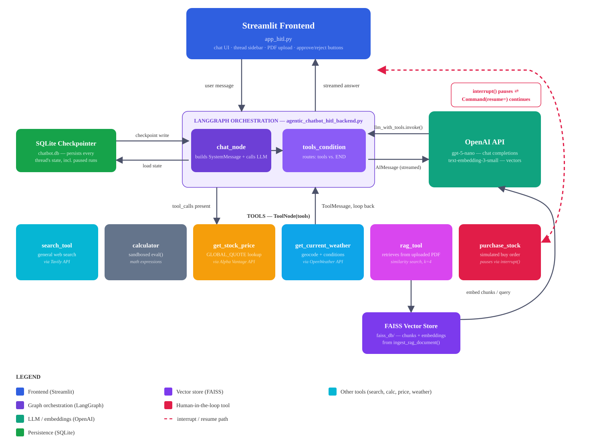

# Agentic Chatbot — LangGraph + Streamlit

An agentic AI chatbot that holds durable conversations, decides for itself which
tools to call, answers questions grounded in PDFs you upload, and **stops to ask
a human before it does anything consequential**.

Built on a LangGraph state graph with a SQLite checkpointer, so a conversation
survives an app restart — including one that is paused mid-tool-call waiting for
your approval.



---

## What it does

| Capability | How it works |
|---|---|
| **Persistent multi-thread memory** | Every turn is checkpointed to SQLite by `thread_id`. Close the app, reopen it, and the sidebar still lists every past conversation. |
| **Agentic tool use** | The model is bound to six tools and picks them itself via `tools_condition`. No hardcoded routing. |
| **Agentic RAG** | Upload a PDF from the chat box; it is chunked, embedded and indexed into FAISS. Retrieval happens through a *tool the model chooses to call*, not by stuffing document text into every prompt. Each conversation gets its own index, so uploads in one thread never affect another. |
| **Human-in-the-loop approval** | `purchase_stock` calls LangGraph's `interrupt()`, which freezes the entire graph mid-execution. The UI shows Approve / Reject and disables the chat input until you decide. |
| **Pause survives refresh** | Because the pause lives in the checkpoint rather than in browser state, you can refresh the page or switch threads and the pending approval is still there when you come back. |
| **Tracing** | Every run is traced to LangSmith when configured. |

### The tools

`search_tool` (Tavily web search) · `calculator` (sandboxed `eval`) ·
`get_stock_price` (Alpha Vantage) · `get_current_weather` (OpenWeather) ·
`rag_tool` (FAISS over your PDF) · `purchase_stock` (simulated, human-gated)

---

## Quickstart

```bash
git clone https://github.com/prashanthmaster/Agentic-Chatbot-using-Langgraph.git
cd Agentic-Chatbot-using-Langgraph

cp .env.example .env      # then fill in your keys
uv run streamlit run app.py
```

`uv run` creates the virtual environment and installs dependencies on first run —
there is no separate install step. Requires Python 3.11–3.13 and
[uv](https://docs.astral.sh/uv/).

---

## Configuration

Copy `.env.example` to `.env` and fill it in. `.env` is git-ignored and must never
be committed.

| Variable | Required | Used for |
|---|---|---|
| `OPENAI_API_KEY` | **Yes** | Chat completions (`gpt-5-nano`) and embeddings (`text-embedding-3-small`) |
| `TAVILY_API_KEY` | **Yes** | `search_tool` |
| `ALPHA_VANTAGE_API_KEY` | For stock lookups | `get_stock_price` |
| `OPENWEATHER_API_KEY` | For weather | `get_current_weather` |
| `LANGSMITH_TRACING` | Optional | Set `true` to enable tracing |
| `LANGSMITH_API_KEY` | Optional | LangSmith |
| `LANGSMITH_ENDPOINT` | Optional | Defaults to `https://api.smith.langchain.com` |
| `LANGSMITH_PROJECT` | Optional | Trace project name |

Tools whose key is absent fail gracefully with a readable message rather than
crashing the app — the rest of the chatbot keeps working.

---

## How it works

The graph is deliberately small:

```
START → chat_node → tools_condition ─┬→ tools → chat_node   (loop)
                                     └→ END
```

`chat_node` prepends a system prompt describing when to use each tool, then calls
`llm.bind_tools(tools)`. `tools_condition` inspects the reply: if it carries
`tool_calls`, control goes to the `ToolNode`; otherwise the run ends. The
`tools → chat_node` edge feeds results back so the model can answer using them.

Two details worth knowing:

**The checkpointer is what makes human-in-the-loop possible.** `interrupt()`
raises out of the middle of a tool, and the graph's entire state has to be
persisted for it to be resumable later. Without `SqliteSaver`, resuming would be
impossible — `Command(resume="yes")` reloads that checkpoint and makes the frozen
`interrupt()` call return your decision.

**RAG is a tool, not a preprocessing step.** The retriever runs only when the
model decides the question needs the document. General questions never pay the
retrieval cost, and the model can combine document context with a web search in
the same turn.

---

## Project structure

```
├── app.py               # Streamlit UI: threads, streaming, PDF upload, approval buttons
├── backend.py           # LangGraph graph, tools, LLM, embeddings, checkpointer
├── docs/
│   └── architecture.svg
├── .env.example
├── pyproject.toml
└── uv.lock
```

Two files generated at runtime and intentionally **not** committed:

- `chatbot.db` (+ `-wal` / `-shm`) — the SQLite checkpointer. Created
  automatically on first run; the schema is built by `SqliteSaver` itself.
- `faiss_db/<thread_id>/` — one vector index per conversation. Created the first
  time you upload a PDF in that thread; further uploads are added to it.

---

## Troubleshooting

**The sidebar is empty on a fresh clone.** Expected. There is no `chatbot.db`
yet; it is created on first run and fills up as you chat.

**The bot says no PDF has been uploaded.** Expected on a fresh conversation —
the index for that thread does not exist until you upload something. Use the
attachment button in the chat input. Note that indexes are **per conversation**:
starting a new chat starts with no document.

**RAG returns irrelevant results after changing the embedding model.** Delete
`faiss_db/` and re-upload. An index must be queried with the same embedding model
that built it; mixing them produces meaningless similarity scores rather than an
error.

**A tool reports a missing API key.** That tool's variable is absent from `.env`.
The rest of the app is unaffected.

**Database looks stale when inspected.** `SqliteSaver` runs in WAL mode, so recent
writes may still be in `chatbot.db-wal`. Stop the app or reopen the file.

---

## Licence

Apache 2.0 — see [LICENSE](LICENSE).
